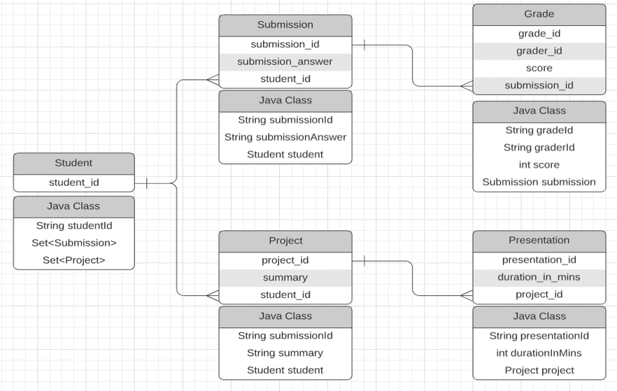

# Simple use case for GALE (JPA version)

This repository is a simple use case in JPA version. 
It is a basic data generator where you can populate 
data using JPA annotation and apply GALE on it.

Each class follows the relation as the entity diagram shown below:


## Setting

* ### Database
    Database setups are all configured in the `resources/META-INF/persistence.xml`
    It follows the format of the JPA annotation setup.
    
    You need to specify: 
    1. `name` property in `<persistence-unit name="<by-your-choice>">`; (This will be later used in GALE initialization)
    2. `value` property in `<property name="hibernate.connection.url" value="jdbc:mysql://localhost:<port>/<dbname>" />`;
    3. `value` property in `<property name="hibernate.connection.username" value="<granted-user-name>" />`;
    4. `value` property in `<property name="hibernate.connection.password" value="<password>" />`;
    
* ### JAR package
    Our jar package is availiable in the directory: "/lib", please include it in the project so it can work.
    
* ### Code Interfere
    In each class that you want to mark as private data, simply add our annotation upon the class
    definition (which we have commented out in our example). 
    ```java
    @PrivateData(primaryKey = "<primary-key-field-in-class>")
    public class xxx { ... }
    ```
  
* ### Test Explanation: `src/GaleInUse.java`
    We make this case simple so user can understand what each line is doing.
    
    If you configure the database correctly, you can execute the first line and populate some data into teh database.
    
    Then we will initialize the GALE instance using JPA mode.
    
    Then the third portion is querying the database using Hibernate ORM, and the result will be printed.
    
    The forth portion is deleting the student with id = 1, where you can justify this in the database.