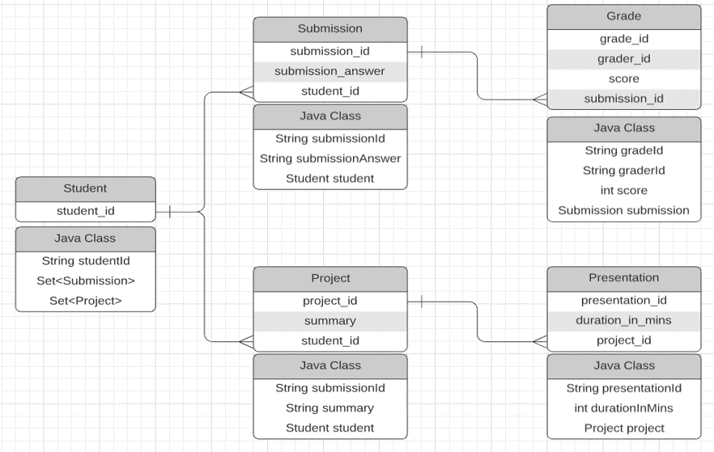

# Simple use case for GAEL(Non-JPA version)

This is an example designed to showcase GAEL in a Non-JPA setting. It can populate data using Hibernate with mapper files and query/delete data with GAEL.

## How to use: 

1. Start your Mysql databse
2. Change the configurations in ```db.properties``` to your own
3. Change ```STUDENT_ID``` in the first row of ```App.java``` to a unique number(details are [here](#code-structure))
4. Run it and have fun

## Database Structure:  

</br>




## Code Structure 
### /src/Entity

Inside this package you can find all the entity classes matching all the tables shown in the database structure image above.

There is also a class ```TableGenerator```, it is used to populate data into your specified database.

### /src/App.java

Entry point of this usecase. Remember to change the ```STUDENT_ID``` in the first row **EVERYTIME** before you run this usecase. Because this is the primary key in the *student* table, if you don't change it, you will get a conflicted primary key error.

### db.properties

This is where you config your database connection.

- url: your db connection url, it is probably something like ```jdbc:mysql://localhost:3306/[YOUR DB's NAME]?useUnicode=true&characterEncoding=utf8&useSSL=true```
- username: your db username, something like ```root```
- password: your password to connect to the db

### Gael-1.0.jar

Star of the party. It is the packaged, importable version of Gael.

### demoMappers.hbm.xml

It is the mapper file for Hibernate, equal to all those JPA annotations in the JPA setting. **Remember this file needs to have a copy in the classpath of the project.** Hibernate refuses to let users specify where mapper files are located, and will only search for them in the classpath of the project. In our usecase(which is a Maven project), the classpath is ```/target/classes```. So if you look into that directory, you can see I have already put a copy of this mapper file there.

### pom.xml

Standard Maven configuration file.